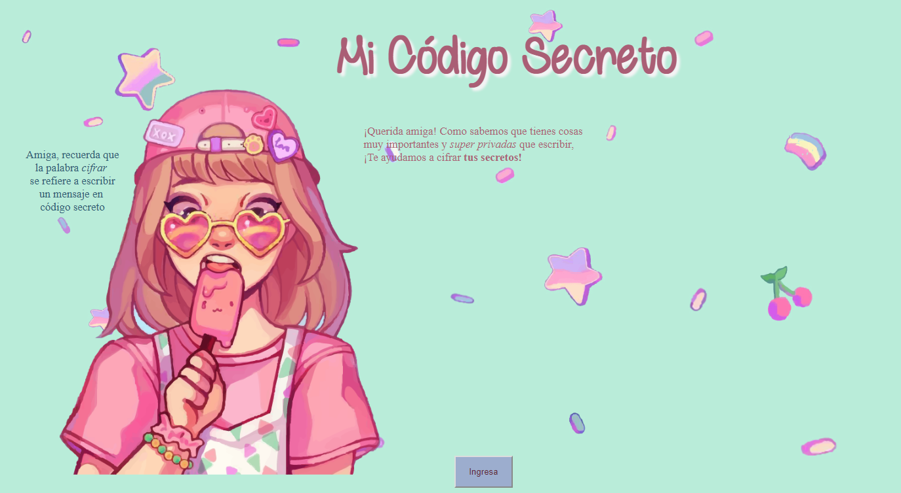
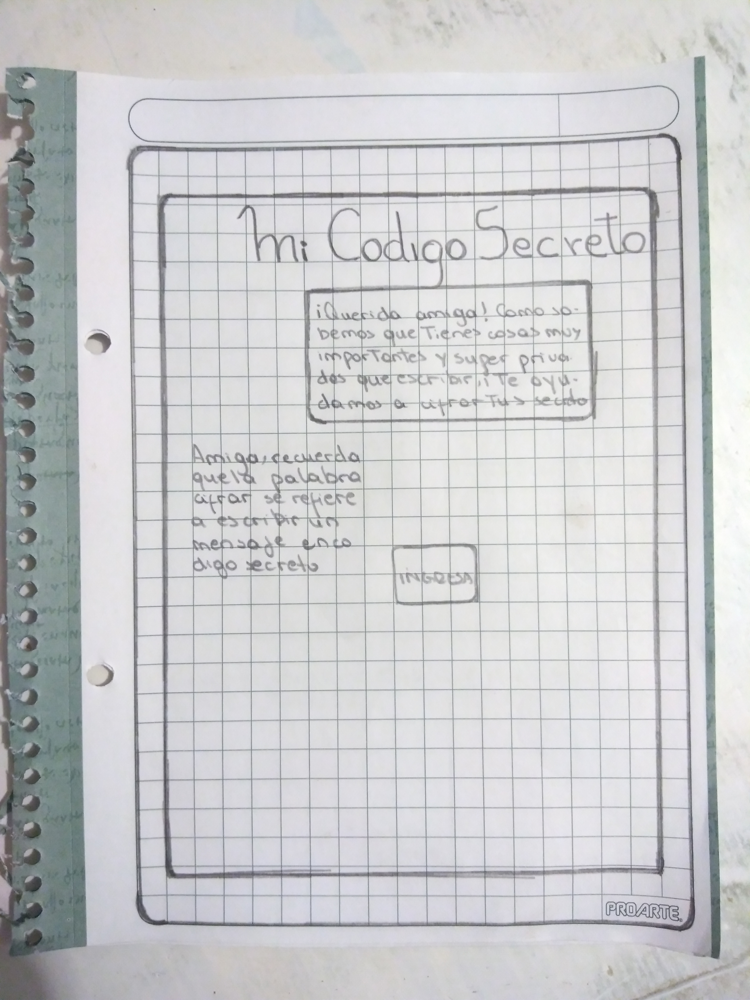
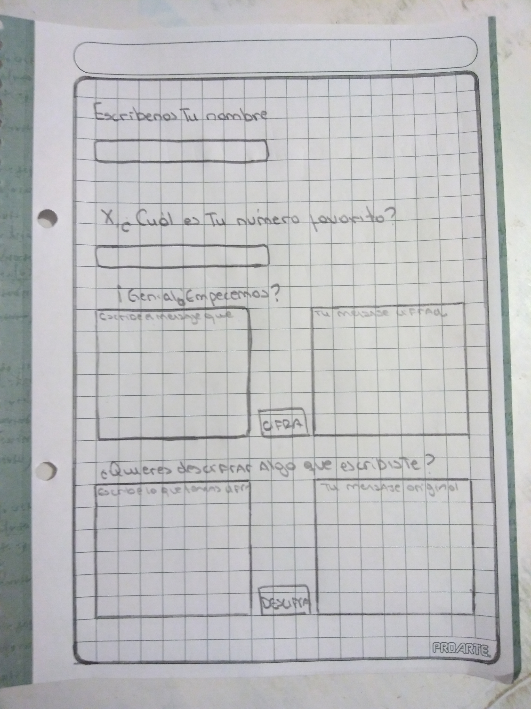

# Mi Codigo Secreto

## Introducción
**Mi Código Secreto** es una aplicación web que está orientado al sector
más joven de nuestra comunidad, más especificamente; a nuestras adolescentes.

Como bien sabemos este público se encuentra en constante cambio, y ante el afán de mantener sus cosas privadas notamos que exitía una necesidad latente por que estas jovenes lograran poner bajo reserva ciertos asuntos, en especial cuando se trataba de algo tan íntimo como su diario de vida.

Fue en ese momento cuando se gestó por primera vez la idea de crear una plataforma que ayudara a estas chicas a cifrar el contenido más íntimo que  quisieran guardar para ellas mismas.

Repetimos que esto no es una aplicación donde puedan escribir sobre sus propias vidas, más bien es un lugar donde pueden generar un texto cifrado cuando no se sabe como ocultar cierta información de un par de ojos indeseados.

## Diseño

Desde un inicio generamos nuestro diseño pensando en nuestras usuarias, por ello decidimos que la plataforma debía ser sencilla, intuitiva y femenina.

Mantuvimos el bosquejo inicial que consistía en dos pantallas ;

## Proceso de creación

Lo primero fue la obtención de la idea. Posterior a eso definimos tanto la temática como el usuario. Con la ayuda del prototipo plasmamos la interacción entre la persona y la aplicación web y generar su relación con el producto de la manera mas amigable posible.

Luego **Trello** fue una herramienta determinante en el proceso de planificación donde subdivimos las tareas a realizar y, a medida que avanzábamos, nos ayudaba al cumplimiento de cometidos y a tener sensación de logro.

<https://trello.com/b/Ra4AcCCu/untitled-board>

Posterior a eso inciamos creando el esqueleto de nuestra aplicación web en HTML, al mismo tiempo,poniendo en práctica la metodología ágil, añadíamos estilos en CSS y avanzabámos en la comprensión del Cifrado Cesar y como este podía ser aplicado en nuestra plataforma. 

Dedicamos bastante tienpo en generar la logíca del producto y la función que llevara a cabo el cifrado y descifrado.

Al finalizar hicimos una iteración con la imagen principal, personalizandola de acuerdo a nuestras usuarias.

## Modo de uso

- La usuaria inicia leyendo de que trata la aplicación.
- Tras eso hace debe hacer click en boton "ingresa".
- La usuaria es direccionada a una segunda página donde debe escribir su nombre en un formulario y apretar "click".
- La usuaria debe responder la pregunta de cúal es su número favorito y escribirlo en otro formulario de tipo numérico.
- Ahí la usuaria puede escribir el mensaje que quiera en mayúsculas y sin ñ, y hace click en el boton "cifrar".
- Su texto cifrado aparecerá al lado.
- Si desea descifrar debe escribir un texto cifrado en el formulario de abajo, y hacer click en boton "descifrar".
- Finalmente el resultado de su contenido original aprecerá en el formulario que esté a su lado.

## Demo

<https://carolinamendezv.github.io/SCL008-Cipher/src/index.html>

